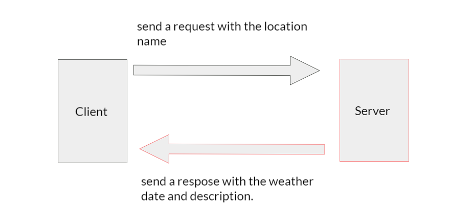

# city-explorer-api

-----

**Author**: Moayad Alhaj
**Version**: 1.0.0

## Overview

This api allows users to requwst weather data by typing the location name for paris, seatle and Amman.

## Getting Started

Used Libraries and frameworks
    - Express
    - Axios
    - core
    - nodemon

## Architecture

For this api, I used Exspress framework .

## Change Log

## Credit and Collaborations

## Request and Response

### 1: Name of feature: (Back-end) weather info for the searched city

Estimate of time needed to complete: 2

Start time: 2:30

Finish time: 4

Actual time needed to complete: 1:30

### 2: Name of feature:(Front-end) weather info for the searched city

Estimate of time needed to complete: 2

Start time: 5:00

Finish time: 8:00

Actual time needed to complete: 3
